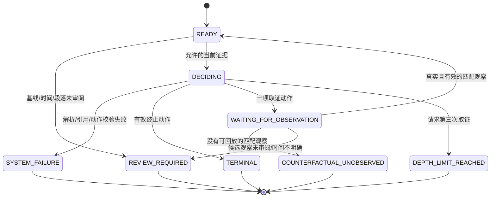

# 状态机初版

这是单病例试运行的控制器，不是已验证的临床策略。状态机负责输入边界、动作合法性、日志匹配和停止；LLM 负责提出 gap 与一个动作。没有训练、自动进化、反事实检查结果生成或 100 例批量调用。

## 研究时点与输入

- D0：被评价的医生决策之前的临床证据快照。医生的当次拟术式、推荐、决策理由、排程及后续结局不进入输入。段落的创建时间早于截止时间，也不能自动解除语义屏蔽。
- D1：有效取证动作匹配到一项经过审阅、时间有效的新观察之后，重新生成快照。
- D2：如第二次追加取证仍有有效观察，更新后作终止判断。两次 acquisition 是上限，不要求每例走满。
- 后续病理/结局：单独留在本地评估材料中，不作为该根治准备 episode 的后续 state。

当前输入为 `clinical-records-v0.2`，详见 [临床资料输入](clinical-input.md)。模型阅读完整影像报告、可用病历正文和全部符合时间边界的检验条目；不再接收研究者拆出的事实、问题域、状态标签或关键指标子集。来源时间按原记录呈现，可用时间判定及代理类型留在执行侧。gap 由模型阅读资料后自行识别。

模型不接收：完整 patient bundle、原始文书全篇、原始患者标识、医生被评价的选择、T1 候选清单、可匹配动作列表、实际术式、终末病理、结局类别或密钥。输入预览由实际调用使用的同一个 `build_messages` 函数生成；`clinical_chart.md` 是模型 user message 的可读副本。原始 v0.1 输出 schema 保持不变，仅约束读完资料后的输出。

## 状态转换



`PAUSE_FOR_EVIDENCE` 是模型的临床动作模式；`WAITING_FOR_OBSERVATION` 是控制器状态。`REVIEW_REQUIRED` 是资料/标注待审阅；`DEFER_TO_EXPERT` 是可靠性处置，不能当作已经识别了临床禁忌。解析失败保留原始最终输出，记录 SYSTEM_FAILURE 和 defer，不修补成临床建议。达到深度上限但未得到终止建议时，保留不完整状态，不强行生成 CONTINUE/EXIT。

## 两种边界显式分开

- `BEFORE_ANY_INCISION`：默认严格边界，切皮后的腹腔镜发现不允许回放。
- `BEFORE_DEFINITIVE_RESECTION`：拟议的根治切除前边界；诊断性腹腔镜观察只有经过动作、部位、gap、发生顺序及终点审阅才能进入 D1。

`STRICT` 要求精确可用时间；`REVIEWED_PROXY` 接受经审阅的检查/文书时间代理及术中叙事顺序，仍保留时间不确定性，不补造精确时刻。精确事件还检查它严格晚于当前时点、早于终点、位于回放窗口内。同一临床操作使用 `clinical_event_id` 去重，不能把活检送检、术后重述和出院重述当作几次新增观察。

这是 `predecision-review-draft-v0.1` 研究变体。原始 contract 文件保持不变，输出格式沿用其严格 schema；run manifest 单独记录该变体、前决策锚点和终点设置。原文的 T0_anchor/before-incision 定义与新增 predecision/根治切除前设置存在差异，不能把后者的结果报告成原始 v0.1 严格术前回放。原文将手术发现放在 oracle 一侧；诊断性腹腔镜观察的例外仅属于拟议变体，正式评价前仍需冻结规范。

## 本地操作

安装环境：

```sh
python3 -m venv --system-site-packages .venv
.venv/bin/python -m pip install -e '.[test]'
```

本地输入预览（不调用 API）：

```sh
.venv/bin/python -m pancreatic_agent preview --baseline private/case-001/baseline.json
```

控制器回放使用 `run --scripted <本地输出数组>`；真实模型需显式使用 `run --live`。无论哪种，未审阅的基线都在模型调用之前停止。没有自动把草稿标成 reviewed 的选项。病例文件和预览/manifest/trace/result 均位于 Git 忽略的目录中。

本机已完成一条合成记录的命令行端到端回放：D0 请求取证 → 揭示匹配观察 → D1 终止。结果为 TERMINAL、两次 policy 调用、零次模型调用。它只验证控制器通路，不代表真实病例的临床评价。命令行新建的预览与日志使用仅当前用户可读写的权限；本机原始数据副本及已有衍生文件也限制为当前用户访问。

## 验证范围与限制

测试使用虚构记录，覆盖：医生决策/未来信息屏蔽、完整报告与全部检验条目保留、矛盾不预先裁定、日期精度、动作/部位/gap 匹配、两种终点、同一操作去重、两次取证上限、反事实停止、原始输出保留、解析错误 defer、预览与 API 请求一致、provider reasoning_content 不保存。

通过 JSON schema 和引用成员校验，不证明临床推理正确，也不证明引用原文支持该结论。段落屏蔽的正则只是补充防线，不能代替语义审阅。临床适宜性、影像是否足以确认转移以及进入根治路径的条件仍由盲于结局的临床评审评价。当前没有实现五次调用一致性 gate、完整效用评分或 100 例评测。
